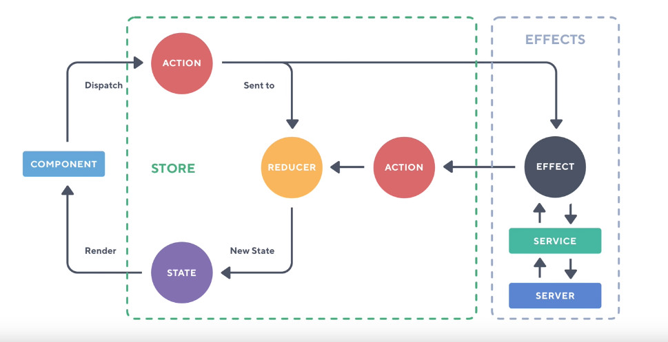

#  ngrx

## 术语

1. Creators : 类 ， 通过类我们可以去实例化（产生）一个对象；
2. factory: 函数，可以根据不同的参数，去生成各种不同的东西；
3. indexable Types https://www.typescriptlang.org/docs/handbook/interfaces.html#indexable-types

```ts
// topping.model.ts
export interface Topping {
  id?: number;
  name?: string;
  [key: string]: any;
}

```

4. register: always specific to module register. after a module registered in a root module or feature module, we can inject service in component of feature or root module ;

```ts
@NgModule({
  imports: [
    StoreModule.forFeature('products',reducers)
  ],
  providers: [],
  declarations: [],
  exports: [],
})
export class ProductsModule {}

```

## the course preknowledge

1. Feature Modules: https://angular.io/guide/feature-modules
2. Lazy Loading Feature Modules : https://angular.io/guide/feature-modules
3. angular && webpack : https://www.youtube.com/watch?v=qmIkoAnttlE

## Project Setup with Webpack  @ngrx/schematics

1. To use @ngrx/schematics as the default collection in your Angular CLI project, add it to your angular.json:

* ng set defaults.schematics.collection=@ngrx/schematics(angular 5) 
* ng config cli.defaultCollection @ngrx/schematics (angular 6)


## ngrx store overview (c 5)

1. change detection and the performance benefits that we get from using a single store or rather an observable approach to managing state in our applications . 

* a component doesn't really care where it gets data from . by default angular has a built in change detection strategy that it's tring to look in your component and it uses sometiong called a zone to be detect whether it needs to update or not  . now we can acturally use 'OnPush' changeDetectionStrategy to tell angular that our @inputs property will be 100% immutable . because of the patterns that we use with a single store we have our reducers which return pieces of new state . these new state are composed in an immutable way and we just simply use a selector to select a piece of state . So whenever that changes  we get it to our container components which then passed doen into stateless presentational component.

* So the beauty of using  the OnPush ChangeDetectionStrategy means that we're acturally comparing objects rather than checking properties and values(这就是使用 immutable 的好处，因为变化只是在自己原来的基础上产生的变化，具体可以看一下immutable) 

* So when we use our OnPush change detection strategy we're essentially telling angular to compare the references of objects rather than try work out what's changed with inside an object . No two objects are the same unless it's the same object , so essentially what will happen when we mutate(变化) some of our data and pass it back to the store , This  in effect will give us a brand new object 

* So angular can say does this object equal this object yes or no . if it's yes then clearly something hasn't changed and nothing will happen further down in that component . However if something has changed , those objects won't acturally equal each other there won't be of the same object identity , so this means angular can just essentially ignore all of the change detection and we can just use observables to push new changes down the component tree .

* We also get the route and feature module support , so we've got eagerly and we've got lazily loaded modules . Now in the application we're going to have a lazy loaded module and we'll use a for feature call on our storeModule which indicates to ngrx store what we have either an eagerly or a lazy loaded module now ngrx will support both of these out-of-the-box .

* we're going to take full advantage of using lazily loaded modules and ngrx behind the scenes when we load in an angular module will then bind itself to the parent store module which we can call the root module;

* a feature module delivers a cohesive set of functionality focused on a specific application need such as a user workflow, routing, or forms. 


## Reactive Component Architecture  (c 6)

1. reactive angular: what is reactive angular in the sense of a component architecture . There are couple of principles that we can use as a guideline when we come to building our angular component tree
* container component : which you see in our our project we have the containers fold and everything which we consider a presentational component just sits in a generic conponent folder 
* we are going to kind of explore some of the characteristics od the difference between the two so we can start to think how the store and the architecture of ngrx store and the effects all fit in to our container and presentational components 


2. The container component is aware of the store , the container component dispathes actions, the container compoennt also reads data from store . So the container is the communicator with our store in this case and we just simply render presentational components which are not aware ot the store. We don't inject the store ,and you can obviously if you like if you have a specific use case , then that is fine to inject the store , but ideally we should be thinking about containers and presentational components and whether something is aware id the store or not aware of store  .

3. The interesting thing between a presentational component is when we want to get something out of a component we then emit an output via angular's wvwnt emitter ,so that's how we get data out of a presentational component. Whereas(但是) if we look at the container we can see that we dispatch an action we still want to get data out of the component but it's now changed from perhaps injecting a service to ok the data is now leaving the component via an action . Now the presentational compoennt reads the data via @input and if we have look at the container it reads the data from the store and then we use something like the async pipe then pass it down as just pure data as an input to a presentational component.


* the orange arrows which represent an output and the gray arrows which represent an input, so we can see immediately at the top that our store is giving a container component an input of the data and it's up to us waht data we ask for from the store and this is where things like ngrx selectors come into play.

* I've added this separation block where we've got this dotted gray line around the presentational components(图中用灰色点画线 圈起来的区域块), So in this ponit I'm assumeing that any presentational component have zero knowledge that the store even exists(对store的存在 毫不知情). It's only given it's data via our container components . So we pass things down to presentational as an input and again we can then emit them as an output 


3. To get data into a container we use a select, to get data into a presentational component we use @input, to get data out of the presentational component we use an @output , to get data back to the store back to the reducer or effect we then use a store dispatch . Above is the data flow and how things communicate 

## Action constants and Creators (c 7)

1. The first thing that our application needs and what we're going to start with is this products component where we're going to dispatch an action saying that 'we want to lad the pizzas '. now when we acturally come to load the pizzas we're going to use ngrx/effects . however that is kind of down the line what we first want to do is kind of understand the building blocks of the store . We are going to populate it with some static data and then we are going to convert that to using an effect where we can communicate with the outside world and then bring that data back to our store. then pass the data into the container component  

```bash
+-- app
+-- products/
    +-- products.module.ts
    +-- container/
    +-- components/
    +-- models/
    +-- services/
    +-- store/
        +-- index.ts
        +-- actions/
            # where the action constants and our action creators are going to live 
            +-- pizzas.action.ts
        +-- reducers/
            +-- 
```

2. pizzas.action.ts

> When it comes to dealing with things like ngrx actions , it's a good ideal to think about the mental process(思维过程) as we go 

* first import the Action , create a class to implement the interface. when we see the typescript defination file , we have export interface action and it has a type property pf string. (其余的意思是，暴露的Action 接口只有一个 type 属性，而我们在实际应用的时候，需要增加许多额外的属性，此时我们的做法是 新增一个接口，用来实现与拓展Action)

```js 
export interface Action {
    type: string;
}
``` 

```js
import { Action } from '@ngrx/store';
import { Pizza } from '../src/products/models/pizza.model.ts';

// Let 's define some new constants , because we talked about namespacing . What I'm going todo is call this [Products], so this acts as a kind of namespace you don't have todo it , because in this example we're not acturally going to load pizzas anywhere else in our application, but it's a good practise to namespace these as per the feature modules(使用 feature module 的名字 作为 nameSpacing name ) 
// load pizzas

//-----------1. action constants
export const LOAD_PIZZAS = '[Products] Load Pizzas';
export const LOAD_PIZZAS_FAIL = '[Products] Load Pizzas Fail';
export const LOAD_PIZZAS_SUCCESS = '[Products] Load Pizzas Success';

// So we've defined the three things that can happed when we load the pizzas . First of all we want to dispatch an action called load the pizzas that's either going to fail or it's going to succeed . If it fails we can dispatch LOAD_PIZZAS_FAIL action ,when it's successful we can dispatch LOAD_PIZZAS_SUCCESS
// we're communicating here kind of via events and  these events describe the steps of what is happending in our application and we can then respond to them accordingly . So you may have guessed the next step is that we want to acturally define some action creators (creators 指的就是类，通过这些类 我们可以去实例或action) 

// The reason we imported Action interface is just to make sure for typescript purpose 

//-------2 action creators
export class LoadPizzas implements Action {
  readonly type = LOAD_PIZZAS;
}

export class LoadPizzasFail implements Action {
  readonly type = LOAD_PIZZAS_FAIL;
  // we can pass any message as a payload property back from the server if there is an error
  constructor ( public payload: any ) {
    
  }
}

export class LoadPizzasFail implements Action {
  readonly type = LOAD_PIZZAS_FAIL;
  // Instead of using a public payload of any , we are acturally going to get a pizza array . Now before we import the type we'll just jump acrooss the db.json which has all pizzas information inside . The db.json is a fake server that just uses pure JSON when we make a request to it , it's going to return the data (即我们要依据 服务器传回的数据形式，来去设计我们的modle, 即 pizza.model.ts)
  constructor ( public payload: Pizza[] ) {
    
  }
}

// In the end, what we now need to do is acturally export our  action types, these are simply used in our reducer , what we essentially need to do is export our own type called PizzasAction , we can then assign `action creators` to this
// ----------3 action types

export type PizzasAction = LoadPizzas | LoadPizzasFail | LoadPizzasSuccess;


```

## c 8 Creating our first Reducer

> we need have a reducer before any of actions can be responded to by our store 

```bash
+-- app
+-- products/
    +-- products.module.ts
    +-- container/
    +-- components/
    +-- models/
    +-- services/
    +-- store/
        +-- index.ts
        +-- actions/
            # where the action constants and our action creators are going to live 
            +-- pizzas.action.ts
        +-- reducers/
            +-- pizzas.reducer.ts
            +-- index.ts
        +-- index.ts
    +-- products.module.ts
```

1. pizzas.reducer.ts

```ts
import { Pizza } from './src/products/models/pizza.model.ts';

//--- 0. import action file
// we need import essentially all of our actions at once , we could do import load pizzas comma , load pizzas fail comma, what I like to do is use asterrisk that will import everything as what we can call that fromPizzas 
import * as fromPizzas from './src/products/store/actions/pizzas.acton';

// in ngrx we make massive(大量的) use of type checking , so let's go and make an interface , what we're going to call is the pizza state  , so this is defining a slice of state   that our reducer will manage   in our entire state tree 
//--- 1. state slice interface 
export interface PizzaState {
  data: Pizza[];
  loaded: boolean;
  loading: boolean;
}


// Inside this file we nedd a few things , we'll start off with our application initial state
//----2. initial state slice 
export const initialState: PizzaState = {
  data: [],
  loaded: false,
  loading: false
};

//---3. reducer function
export function reducer(
  state = initialState,
  action: fromPizzas.PizzasAction
):PizzaState {
  // 此处是一个易迷糊点 action是 fromPizzas.PizzasAction 即 `action creator` 的一个实例, 每个实例都有一个type 属性；而 type 属性又指向  `action constants` 
  switch(action.type) {
    // return a new representation of the state . We are going to return a brand new object , Now what we want to return is merging all of the initial state in , so our return statement is now conforming to what we've told it to in our reducer . 
    
    //-1- In fact when we dispatch an event called LOAD_PIZZAS , we're essentially telling the application that we are loading , in the initial state we've setted loadding false , so in this case we just want just say loading is true ;
    case fromPizzas.LOAD_PIZZAS: {
      return {
        ...state,
        loading: true
      }
    }

    //-2- In the LOAD_PIZZAS_SUCCESS case , we don't need to say that it loading ,so we're going to toggle that back to false . When the pizzas are loaded we want to acturally tell  our store that the state is now changed to load .  This allow us to contrl things like loading spinners , and when we come on to route guards we'll acturally be using this loaded preoperty to find out whether we loaded the pizzas , otherwise we're going to dispatch an action and make sure that those pizzas are loaded for us ;
    case fromPizzas.LOAD_PIZZAS_SUCCESS: {
      return {
        ...state,
        loading: false,
        loaded: true
      }
    }

    // in the LOAD_PIZZAS_FAIL situation , we're going to change loading property to false, and loaded property is also false , because on a fail we have definitely not loaded anything and this will eradicate(摧毁，连根拔起) any previous state 
    case from Pizzas.LOAD_PIZZAS_FAIL: {
      return {
        ...state,
        loading: false,
        loaded: false
      }
    }
  }

  return state;
}


```

2. store/reducers/index.ts

> The index.ts contains all of the reducers for the particular products feature module . Becasue we have a products module we're acturally going to export a new interface and we're gong to say this is the products state . 

```ts
import * as fromPizzas from './src/products/store/reducers/pizzas.reducer';

import { ActionReducerMap } from '@ngrx/store';
// we're acturally jumping up one level here , we're got a reducer that we've created, but we need to acturally make it part of the store .
//--1-- the module state which is a slice of entire state tree 
export interface ProductsState {
  //So at this point we're defining the structure of our state tree, so in our ProductsState we're going have a slice of State call pizzas. The actrual interface for this is going to correspond PizzaState which in pizzas.reducer.ts 
  pizzas: fromPizzas.PizzaState;
  // We've now composed a new interface that uses another interface further down our state tree (state tree 是分层的，首先是顶层的，state 其次是 feature module 的 ProductsState 底层是 PizzasState , 此处我们在构建中间层的时候利用了底层的PizzaState)
}

//--2-- Register our reducers ActionReducerMap
// On our reducers we know that slice of state is managed by a reucer function . The first of state is pizzas and consequently that is managed by the fromPizzas.reducer, so we're essentially taking our reducer function binding it to the pizzas . Now we can acturally type check this , so ngrx give us a small little utility which we can use so we can say import something called ActionReducerMap. The ActionReducerMap accept a generic type so what we can say is ProductsState . We're difinitely implementing the correct reducers based on the different levels of state .
// the reducers is essentially describing what these reducers look like and how they are composed 

export const reducers: ActionReducerMap<ProductsState> = {
  pizzas: formPizzas.reducer,
}

```
3. store/index.ts 
> 生成这个文件的原因见下

```ts
// to pass up what we just crated , so we are inside our reducers folder we have a index.ts(reducers/index.ts) , we can essentially access the reducers: ActionReducerMap

// we need to do this because this is boilerplate with setting up our store piece-by-piece(一个接一个,一片一片的)
export * from './src/products/store/reducers'

// 目的是 pass the reducers up one directore so er can access it in products.module.ts 

```

4. products.module.ts

```ts

//import the StoreModules, because our products module has no idea that ngrx store exists at this point or that we want to start creating our own data structures
// It's up to us at this point to go and register this module  
import { StoreModule } from '@ngrx/store';

// 
import { reducers } from './src/products/store';

//----
@NgModule({
  import: [
    //-----
    // forFeature allows us to essentially lazy load everything to do with our store and it will bind itself to the root store object , so we"ve just got one object and when we lazy load a module , such as the ProductsModule itself which is completely lazy loaded.
    // Once we use the foFeature this will essentially attach itself to our root store (app.module.ts---  StoreModule.forRoot({}, { metaReducers }),)
    // When our products module loads ，we then bind StoreModule.forFeature() to that root object . So that's what is happending that's the idea behind it .
    // The forFeature method accepts an argument , we need to say that it's going to the 'products' and we can then pass an empty object as the second argument . The empty object is acturally going to be our reducers so inside the /products/store/ folder waht we need to do again is acturally export evertthing inside of here. That is why we created this products/store/index.ts 暴露整个sore 的所有东西；
    
    // our reducers are now registered with our feature store module 
    StoreModule.forFeature('products', reducers)
  ]
})
export class ProductsModule {}

```

## c 9 Store Selectors

1. register our storeModule and use Store in the component 

```ts
// in pizzas.reducer.ts
export const initialState: PizzaState = {
  data: [],
  loaded: false,
  loading: false
};
```

Now what we acturally want to do is somehow display one particular property(data) which will be our array of pizzas  in the actural angular application , so the way we do this is through something  called a selector .
 
Now before we get started what we're going to do is acturally populate this initial state with some values . we're going to jump into the db.json and we're going to take any pizza you can just select any one that you want . Now we can copy that whole object , now waht we're going to do is just paste it for now inside of the data property. So we're providing some initial stae to our pizzas so we're going to end up with one pizza . once we've finalized creating a selector which allows us to select this particular slice of state.

```ts
// in pizzas.reducer.ts
export const initialState: PizzaState = {
  
  loaded: false,
  loading: false
};
```


What we acturally want to do before any of that is set up our container conponent to accept the store.   

```ts
// products/containers/products/products.component.ts

//--1 import store
import { Store } from '@ngrx/store';
//--2 import Observable type checking
import { Observable } from 'rxjs/Observable';
//--3 import anything from store
import * as fromStore from './src/products/store';

// products/containers/products.component.ts
export class ProductsComponent implements OnInit {
  pizzas: Pizza[];

  //--4-inject store-- What we acturally want tosso is allow us to pass the ProductsState, so we can acturally type check this inside of a component 
  // 依赖注入 Store : inside the constructor we can say private store is going to be of type Store which accept a generic type as well( because store is an observable of state and an observer of actions, so the same as Observable we should specify a generic type) .
  // we can specify fromStore.ProductsState, that mean we can access that ProductsState. So this is type checking that anything that we access inside of here alongside of our ProductsState . 
  //That means that we can only select things from the store that correspond or exist in the ProductsState 
  constructor(privite store: Store<fromStore.ProductsState>) {}

  // how we can obtain properties from our store ? we can use the store.select() method 
  ngOnInit() {
    // we can pass in either a string or or we can pass in a function , if we pass in a function , it will return us a lice of state . 
    // For this I'm going to do is just say select me the 'products'. now we're doing this because we have a slice of state 
    // what we need do is essentially create a selector with the top=level property of 'products', so that we could jump a level down into our data structure to be able to access defferent properties  (select 中所传递的 'product' 实际上是 selector的一个 property ) ('products' 实际上是和 /products.module.ts 中的  StoreModule.forFeature('products',reducers) 这条代码相对应的)
    this.store.select<any>('products').subscribe(
      state => {
        console.log(state);
      }
    )
  }
}
```
********** 打印结果


```ts
// store/index.ts
export interface ProductsState {
  pizzas: fromPizzas.PizzaState,
}

export const reducers: ActionReducerMap<ProductsState> = {
  pizzas: fromPizzas.reducer,
}

// we just created a pizza reducers and we call that the pizzas . The pizza reducer then manages a small selection of state which have the data , the loaded, the loading property ;
// the store.select() method give us the state for the particular module which in our case is the products module and when we registered our store we said StoreModule.forFeature('products',reducers)

// we passed in that string which says products , so that's why we've asked in the select method for a property called 'products'
```

2. selector 


* how do we get the data property of state in to component For the above we need something called selector. 
* selector is essentially a function where we can compose different levels of state and we can return a new piece of State
* Let's create our first selector which will allow us to render the 'data' in to our angular application.

```ts
// products/store/reducers/pizzas.reducer.ts

// what we can do is to export a function which allows ngrx is essentially access PizzaState property without us needing to repeat ourselves over and over again .
// so selecttor is somthing you use to compose state state and then we actually use the selector alongside store.select() in our components 
export interface PizzaState {
  data: Pizza[];
  loaded: boolean;
  loading: boolean;
}

// function which accept state that type of PizzaState  , so this is the piece of state that were given to us and it's going to be of type PizzaState
export const getPizzas = (state: PizzaState) => state.data;
export const getPizzasLoaded = (state: PizzaState) => state.loaded;
export const getPizzasLoading = (state: PizzaState) => state.loading;
// these are small functions that get passed the small level of the pizza state and at that point in time we are down in our data structure . So this is a goog practice, put these undernearth your reducers.
// Now we can compose things one level up and acturally pass this into what we call a create selector function (in reducers/index.ts)

```

* to create the base level of our state object .

```ts
// reducers/index.ts

import { createFeatureSelector, createSelector } from '@ngrx/store';

// this is going to be a constant which holds a selector for our entire lazy loaded module . Now to create a selector waht we need to do is to import createFeatureSelector method , and pass in a string called 'products';
// where this 'products' come frome? this was acturally when we register our module StoreModule.forFeature('products',reducers) . this particular feature starts with an object property called products ,so anything in this feature module is relied on a property called 'products'

// so below code is creating a base reference to that 'products property' on our state . Because we have typescript here  what we can actually do is pass in the ProductState as the generic type ;


export const getProductsState = createFeatureSelector<ProductState>('products');

// To get this working in our component we acturally need another selector to essentially compose our product state , so we take the top level products and we'll 

// pizzas state
// to export another const , what this is going to do is return us the products.pizzas . So we're going from from the top and  down from products , then we're selecting that pizzas piece of State. Now we can do this by using the createSeletor, instead of the createFeatureSelector
// to import the createSelector function , then we can pass in other selectors or we can pass in the functions we just created in products/store/reducers/pizzas.reducer.ts , which then we can pass to a component to select that slice of data all the way down the state tree 

// To use create selector is how we compose our application state . so how do we get the pizza state what we want to do is just create at the moment of reference to the next step down the state tree . 

export const getPizzaState = createSelector(
  // --- at this point we acturally have getPizzaState which is going to pass in the ProductsState 
  getProductState,
  
  (state: ProductsState) => {
    state.pizzas
  }
);

```

* Then we're acturally going to return state state.pizzas, essentially what we're saying is 'give me the products!. okay! here is the products. now give me the pizzas! ' 

```ts
// reducers/index.ts

import { createFeatureSelector, createSelector } from '@ngrx/store';

import * as fromPizzas from './pizzas.reducer';

// 获取相对于 feature module 的root state;
export const getProductsState = createFeatureSelector<ProductState>('products');

export const getPizzaState = createSelector(
  getProductState,
  (state: ProductsState) => {
    state.pizzas
  }
);

export const getAllPizzas = createSelector(
  // because we want to actually jump straight down the state tree , we can pass in getPizzaState as the argument , next callback function will be fromPizzas.getPizzas
  getPizzaState,
  fromPizzas.getPizzas
);

export const getPizzasLoaded = createSelector(
  getPizzaState,
  fromPizzas.getPizzasloaded,
)

export const getPizzasLoading = createSelector(
  getPizzaState,
  fromPizzas.getPizzasloading,
)

```

3. conclusion  --- explaining 

```ts
//1. let's assume we have a Javascript object and we have products object . 
const state = {
  // 2. Inside the products we've defined that we're going to have some level of pizzas , 
  products: {
    //3. **now our pizza reducer acturally manages this slice of state*** , which has the data, loaded, loading property 
    //4. this is essentially our entire ngrx store state tree .** We creat products as a feature module, so when our products feature module is loaded . ngrx store can add ``products: {....}```dynamically and the reducers(store/indext.ts) dynamically to our state tree . 
    // 5. When the reducers are added to the state tree ,we've got one reducer  called pizzas inside  , and we bing our pizzas reducer to it . inside pizzas{..} we have data , loaded , loading 
    // 6. So we're essentially stepping through the state tree by using selector functions 
    // 7. We're first getProductsState(reducers/index.ts) , which is essentially getting a reference to products:{...}
    // 8. getAllPizzas is reference to pizzas:{...} etc.


    pizzas: {
      data: [],
      loaded: false,
      loading: false
    }
  }
}
```

The whole point of a selector is allow us to essentially separate our application state with our component trees , and we can compose our application state and then simply pass the slice we need to the particular component . 

so in our case when we have the products component we want to essentially get all of the pizzas . 

instead of passing in a string (`this.store.select<any>('products').subscribe`) , because we would have to manually go down from products and then we'd have to go to pizzas and then we'd have to go dwon into data and acturally do this every single time. So we can compose these selectors and we  can simply say :`this.store.select<any>(fromStore.getAllPizzas).subscribe`. So we're just going to ask for all of the pizzas. Now because we're doing this we can get rid of the generic type `this.store.select(fromStore.getAllPizzas).subscribe` 

```ts
// products/containers/products/products.component.ts

export class ProductsComponent implements OnInit {
  pizzas: Pizza[];

  constructor(private store: Store<fromStore.ProductsState>) {
  }

  ngOnInit() {
    // this.store.select<any>('products').subscribe(
    //   state => {
    //     console.log(state);
    //   }
    // )
    // instead of passing in a string , because we would have to manually go down from products and then we'd have to go to pizzas 

    this.store.select(fromStore.getAllPizzas).subscribe(
      state =>{
        console.log(state);
      }
    )
  }
}

```

At this point we have successfully written a few selectors to allow us to jump dwon our state tree and just using a single function . we can traverse the state tree and get given back the data that we asked for ;

The interesting is the store.select() acturally returns and observable which we know , because we are now subscribing to it . However with angular we have the asynch pipe where we can pass the observable straight to our template . So let's go back amd implement the asynch pipe and we should see our pizza being rendered out in the dom ; 

***************The sense of using selector ****************************
> The purpose of using selector is to get the specific slice data  of state, which is a observable stream , then we can straightly pass the observable stream in the impure async pipe. then render the data in the component template.

> what this will do is take that observable which is given to us from store , The store will then call the select function ,then composed our selectors for us , then return sigle slice of state that we're asking for . we then bind the data to the pizzas$, then we subscribe with the async pipe 
*********************************** 

```ts
// products/containers/products/products.component.ts

import { Component, OnInit, ChangeDetectionStrategy } from '@angular/core';
import { Pizza } from '../../models/pizza.model';
import { Store } from '@ngrx/store';
import { Observable } from 'rxjs/Observable';
import * as fromStore from '../../store';

@Component({
  selector: 'products',
  styleUrls: ['products.component.scss'],
  template: `
    <div class="products">
      <div class="products__new">
        <a
          class="btn btn__ok"
          routerLink="./new">
          New Pizza
        </a>
      </div>
      <div class="products__list">
        <!- using the async pipe to subscribe the pizzas& observable->
        <div *ngIf="!((pizzas | async)?.length)">
          No pizzas, add one to get started.
        </div>
        <pizza-item
          *ngFor="let pizza of (pizzas | async)"
          [pizza]="pizza">
        </pizza-item>
      </div>
    </div>
  `,
})
export class ProductsComponent implements OnInit {
  // pizzas: Pizza[];
  pizzas$: Observable<Pizza[]>;

  constructor(private store: Store<fromStore.ProductsState>) {
  }

  ngOnInit() {
    // this.store.select<any>('products').subscribe(
    //   state => {
    //     console.log(state);
    //   }
    // )
    // instead of passing in a string , because we would have to manually go down from products and then we'd have to go to pizzas 

    this.pizzas$ = this.store.select(fromStore.getAllPizzas);
    // this.store.select(fromStore.getAllPizzas).subscribe(
    //   state =>{
    //     // console.log(state);
    //     // we can straightly pass this observable in async pipe which accept a promise or observable.
        
    //   }
    // )
  }
}

```

## c10 @Effect and Concept 

1. What is ngrx/effects?

Essentially it's a side effects model for ngrx store . This is means that we can perform various side effects which we'll come on to momentarily outside of the ngrx store package . 

2. the using of ngrx effects?

* Listen for ngrx/store actions

* Isolate side effects from components

* Communicate outside of Angular

This is really nice , because for instance we had some kind of load event , we want to load something in our application . We could do this inside a reducer, but this would actually be creating an asynchronous request inside something that's considered a pure function(reducer is a pure function).

So immediately those type of things are kind of the wrong approach , so we want to take the rigth approach with a side effects model that's built for the technology we're using . 

So importantly we can dispatch some kind of LOAD event and we can actually listen to this action inside the effect . 

We can then communicate outside of angular , then using something like angular's HTTP  package or for Instance something like a Websocket where it's outside of the angular ecosystem we're dealing with  , outside of the angular world .

So we can communicate outside of angular and as a result we're isolating  those side effects away from our component and this can be something as simple as routing.

typically we would do sime routing and we inject angular's Router into a component , we'd listen to a callback in a service then we'd redirect away . however 

3. The Effects flow 



Let's introduce effects , you can think of effects as a outside of the store which it's just a mechanism that we can use to go and fetch data so then put back in our store. So we're essentially jumping out of the store momentarily(立即) and then bringing something back . 

In fact we can listen to store actions ,so this is what would happen when we use in effect . We can set up effect to say 'ok! I'm actrully interested in this LOAD action as well', and it may be that our reducer is also interested in the same action(所以途中的action 分成了两条线);

The difference is the reducer is a pure function, it is sychonous, and nothing is happening inside of there apart from(adv:除了...之外) taking data and merging it as a new state however .

However when we deal with an effect we can actually use somthing like a service or a WebSocket to go off to the server. So at this point our effet can say 'ok! angular service we want to do something outside of this store'. So it's time at this point where we can continue the journey and we can say 'ok! we've hot the server '. At this point we can say 'ok! give me some particular JSON ' . 

Once we got the data that's come back from the server we then get this as an observable inside of our service . We get an observable of response . So what wan can do  is essentially plug in our service to an effect which is an observable stream . 

In our case waht we will have is a service that returns an observable and an effect which is an observable stream . We can then map over thing and we want to acturally get the data back inside the reducer at this point . 

When something as asynchronous is completely we want to then back to the reducer . So the question is how at this point do we get something back into the reducer . 

*our effect is kind of outside of the store* . It's in control of something else , so we want to dispatch an action from our effect .

Let's assume that our first action dispatched a "Load". It's might be that the effect listens to the 'LOAD' event and grabs our service and says 'ok! go and fetch me all of this data '

We bring back the data and inside the effet we can then dispatch a 'SUCCESS' action which means that automatically we can listen to that in our reducer and we get  the response as the the 'action.payload'. 

So it's just a nice.  Outside of the store we can make a synchronous request , we can bring it back and dispatch a new action , such as 'SUCCESS' and we brought back to the reducer and then we have the whole lifecycle trip where we merge new state and then it comes back and renders to the component 

The we can start the journey all over again if our component dispatched a new action and we could listen something in the reducer , we can listen to something in the effect , we can make a synchronous request and bing back to our store which is our centralized location and single source of truth      

## c 11 Creating an @Effect 

```bash
+-- app
+-- products/
    +-- products.module.ts
    +-- container/
    +-- components/
    +-- models/
    +-- services/
    +-- store/
        +-- index.ts
        +-- actions/
            +-- pizzas.action.ts
            +-- index.ts
        +-- reducers/
            +-- pizzas.reducer.ts
            +-- index.ts
        +-- index.ts
    +-- products.module.ts

```

1. actions/index.ts 
> At the moment we have the 'fromStore' and what we need to do is now pass our actions up to our components . so we can asscess them via the 'fromStore' alias . we just need to create a index.ts in the actions folder

```ts
// store/actions/index.ts
export * from './pizzas.action';

```

```ts
// store/index.ts
export * from './reducers';
export * from './actions';

```


2. dispatch our first action in products.component.ts

```ts
import { Component, OnInit, ChangeDetectionStrategy } from '@angular/core';
import { Pizza } from '../../models/pizza.model';
import { Store } from '@ngrx/store';
import { Observable } from 'rxjs/Observable';
import * as fromStore from '../../store';

@Component({
  selector: 'products',
  styleUrls: ['products.component.scss'],
  template: `
    <div class="products">
      <div class="products__new">
        <a
          class="btn btn__ok"
          routerLink="./new">
          New Pizza
        </a>
      </div>
      <div class="products__list">
        <div *ngIf="!((pizzas$ | async )?.length)">
          No pizzas, add one to get started.
        </div>
        <pizza-item
          *ngFor="let pizza of (pizzas$ | async )"
          [pizza]="pizza">
        </pizza-item>
      </div>
    </div>
  `,
})
export class ProductsComponent implements OnInit {
  pizzas$: Observable<Pizza[]>;
  constructor(private store: Store<fromStore.ProductsState>) {
  }

  ngOnInit() {
    // we're actually just using the initial state from the reducer , but it might be a good idea to actually introduce where we can dispatch an action to call our firt 'LOAD' event ;
    this.pizzas$ = this.store.select(fromStore.getAllPizzas)

    // To create our first action 'LOAD PIZZAS' , and at the moment in our reducer function we have already are listening to this 'LOAD PIZZAs'. So at this point in time the store has  called the reducer and we are returning the new state , say 'loading is true ';() 也就是说 组件 dispatch action 之后，这个action 不会想自己以前想的那样，会被effect 拦截。 而是会直接传到 reducer中去， 并返回一个新的 state)

    // we are waiting for 'LOAD_PIZZAS_SUCCESS', and this is where @ngrx/effects comes into play , we want to set up an effect to listen to our 'LOAD_PIZZAS' action, and it's going to make the request using one of our services , and then we're going to dispatch 'LOAD_PIZZAS_SUCCESS' from the effect , where we will be able to obtain the new state;

    this.store.dispatch(new fromStore.LoadPizzas());
  }
}


```

3. create pizzas.effect.ts

```bash

+-- app
+-- products/
    +-- products.module.ts
    +-- container/
    +-- components/
    +-- models/
    +-- services/
    +-- store/
        +-- index.ts
        +-- actions/
            +-- pizzas.action.ts
            +-- index.ts
        +-- effects
            +-- pizzas.effect.ts
        +-- reducers/
            +-- pizzas.reducer.ts
            +-- index.ts
        +-- index.ts
    +-- products.module.ts

```

```ts
// pizzas.effect.ts

// Inside with this file , I will roll with the effect is to actually listen for that load pizzas action and then we're going to produce a different side effect.
// The side effect of this case is we're acturally communication via HTTP to our local server and then we're going to bring that information back and then we're going to dispatch a new action saying that the request was successful .


import { Injectable } from '@angular/core';

// Actions is an observable ,we can then listen to the types of Actions that are being dispatched and respond to them accordingly 
import { Effect, Actions } from '@ngrx/effects';

// import actions
import * as pizzaActions from './actions/pizzas.action';
import * as fromServices from '../../services';

import { switchMap, map, catchError } from 'rxjs/operators'；
import { of } from 'rxjs/observable/of';

@Injectable()
export class PizzasEffects {
  // effect is essenctially a class which contains a few properties which happen to be observables. now our observables get called by ngrx effects and kind of in a way act like a reducer so it allow us to reponse to different events  and do different things 
  // Now the role of reducer is to actually deal with pure javascript state and immutabe objects . In this case we're going to listening to some events that are acturally dispatched ,however we're dealing with observable streams and in our case we're using the pizza service to fetch some pizzas and then dispatch a new success action when they come back from server .

  // Actions is an observable 
  constructor(
    private action$: Actions, 
    private pizzaService: fromServices.PizzasService
  ) {}
  
  // create property called loadPizzas$ which is going to be an observable 
  // we can actually say that we want to listen an action of the  specific type 
  // *because in our component we have just dispatched that 'LOAD_PIZZAS'*, so  we just will listen to the 'LOAD_PIZ ZAS' action. 
  //*********************************************************************
  // This is where we want to perform a side effect . This is an observable stream and we can add observables to it we can return new observables and interestingly enough angular's HTTP client module returns an observable which means it fits directly into an effect .(因为 HTTP 模块也是返回 一个observable, 所以我们可以将 HTPP 模块 加到observable 流里面， 然后返回一个新的 observable), 这个逻辑 就类似于 promise chain 一样，一样的，无非是换了一种形式而已， 此处也是神技了 执行异步的神技）
  //*******************************************

  // This effects when the loadPizzas$ is executed we need to return an action and that is the key to understanding what an effect does. It doesn't do much more than what we're actually  looking at , we just need to mark it as an effect using @Effect() decorator and then dispatch a new action back 
  @Effect()
  loadPizzas$ = this.actions$
              .ofType( pizzaActions.LOAD_PIZZAS )
              // the pipe doesn't really do much itself but we can pass other operators go inside the pipe and this just simply contains a stream of pure functions instead of chaining them with the prototype ooperators so this 
              .pipe(
                switchMap(
                  () => {
                    return this.pizzaService.getPizzas().pipe(
                      map(
                        pizzas => new pizzaActions.LoadPizzasSuccess(pizzas),
                      ),
                      catchError(
                        // 当 请求出现了错误，则我们所接收到的，就不再是一个 observable 了，服务器返回的只是一个error.  而 loadPizzas$ 是一个 observable 类型的，所以再返回之前我们需要将器转化为一个 observable; 利用of 函数；

                        // import { ArrayObservable } from './ArrayObservable';
                         // export const of = ArrayObservable.of;
                         // 即 of 是 Observable.of
                        error => of(new pizzaActions.LoadPizzasFail(error));
                      )
                    )
                  }
                )
              )
}

```

> The effect allows us to communicate with the outside world and then the whole idea is that we bring data back to our reducer .  
> 这就像一个中间件 ---> express 中间件，是截取 req 流； 而 ngrx 中间件是 截取 action stream ---> actions$; 也是对这个流 做一部分处理  ` 但 即然 其为 actrion 流，不管对其做了什么处理，不管其变为了什么，其始终是action 流（type限制），其始终要流向reducer, 然后导致 sate 变化`

> THe complete round trip for our effects class: We're listening to the 'LOAD_PIZZAS' event which we're dispatching that in the component . we're using a switchMap operator to switch to a brand new stream `which means that the new action is returned to our @Effect()`. By default an effect will dispatch in action , we can config it with option ---> @Effect( { dispatch: false } ) this is an option that nothing will be dispatched 

4. /effects/index.ts

```bash

+-- app
+-- products/
    +-- products.module.ts
    +-- container/
    +-- components/
    +-- models/
    +-- services/
    +-- store/
        +-- index.ts
        +-- actions/
            +-- pizzas.action.ts
            +-- index.ts
        +-- effects
            +-- pizzas.effect.ts
        +-- reducers/
            +-- pizzas.reducer.ts
            +-- index.ts
        +-- index.ts
    +-- products.module.ts

```

```ts
// store/effects/index.ts

import { PizzasEffects } from './pizzas.effect';

//we just want ro maintain everything in this one file ;
// we can basically create an array of effects , we can give it a type of any array and we can just simply pass that pizza effectsas the first element.
// this means that in our module ,we can just import the effects array and just register them as a whole , and we don't need to keep importing things . It ends up with this really big module file with all these imports everywhere. 
export const effects: any[] = [ PizzasEffects ];

// This is pretty much what 
export * from './pizzas.effect';

```

```ts
// store/index.ts
export * from './reducers';
export * from './actions';
export * from './effects';

```

5. to register the EffectsModule

```ts
// products.module.ts

import { NgModule } from '@angular/core';
import { CommonModule } from '@angular/common';
import { Routes, RouterModule } from '@angular/router';
import { ReactiveFormsModule } from '@angular/forms';
import { HttpClientModule } from '@angular/common/http';
import { StoreModule } from '@ngrx/store';
import { EffectsModule } from '@ngrx/effects';

// import the effects array
import { reducers, effects } from './store';
import * as fromComponents from './components';
import * as fromContainers from './containers';
import * as fromServices from './services';

export const ROUTES: Routes = [
  {
    path: '',
    component: fromContainers.ProductsComponent,
  },
  {
    path: ':id',
    component: fromContainers.ProductItemComponent,
  },
  {
    path: 'new',
    component: fromContainers.ProductItemComponent,
  },
];

@NgModule({
  imports: [
    CommonModule,
    ReactiveFormsModule,
    HttpClientModule,
    RouterModule.forChild(ROUTES),
    StoreModule.forFeature('products',reducers),
    // register EffectsModule
    EffectsModule.forFeature(effects)
  ],
  providers: [...fromServices.services],
  declarations: [...fromContainers.containers, ...fromComponents.components],
  exports: [...fromContainers.containers, ...fromComponents.components],
})
export class ProductsModule {}

```

6. modify the initial sate in the reducer

```ts
// store/reducers/pizzas.reducer.ts

// initial state
export const initialState: PizzaState = {
  data: [],
  loaded: false,
  loading: false
};

// reducer function
export function reducer(
  state = initialState,
  action: fromPizzas.PizzasAction
): PizzaState {
  switch (action.type) {
    // loading event
    case fromPizzas.PizzaActionTypes.LOAD_PIZZAS:
      {
        return {
          ...state,
          loading: true
        }
      }

      // load success event
    case fromPizzas.PizzaActionTypes.LOAD_PIZZAS_SUCCESS:
      {
        const data = action.payload;
        return {
          ...state,
          loading: false,
          loaded: true,
          data
        }
      }

      // load fail event
    case fromPizzas.PizzaActionTypes.LOAD_PIZZAS_FAIL:
      {
        return {
          ...state,
          loading: false,
          loaded: false
        }
      }
  }
  return state;
}

```


## c12 Optimizing Datastructure with Entities

We're going to optimizing our data structures for performance reason . So what we're going to do is jump into pizzas.reducers.ts file . in there we just hava an array of pizzas . Now in a bigger application this is not going to scale or handle well when we want to do things very fast . So thinking ablout using objects instead of an array might be better approach. 

So what we're going to do instead of using an array we're acturally going to change our data structure over to what we call an entity . In the server side you might  have entities and we might look things up by IDs `in this case you can think of ngrx store as some kind of database for te client`, then we can use the selectors which we've already created  to query the database and compose new object and return them to our component 

1. refactory store/reducers/pizzas.reducer.ts

```ts
// store/reducers/pizzas.reducer.ts

// state slice interface
export const initialState: PizzaState = {
  //--1 So what we want to do now is to refactor this over to became an entity . we're going to create an object which holds our entities and we're going to store them via an ID which which is going to be of type number . now every single entity will hold each particular pizza . So instead of just having one data property we're going to have entities which contains all of our pizzas and each pizzas ID is going to be the key inside the object .

  // data: [],
  // Indexable Types； if we use entities[10] it must be of type Pizzas; 
  entities: { [id: number]: Pizzas },
  loaded: false,
  loading: false
};


// initial state
export const initialState: PizzaState = {
  // data: [],
  //--2 what we want to do is just initializa entities with a brand new empty object . 
  entities: {},
  loaded: false,
  loading: false
};

// reducer function
export function reducer(
  state = initialState,
  action: fromPizzas.PizzasAction
): PizzaState {
  switch (action.type) {
    // loading event
    case fromPizzas.PizzaActionTypes.LOAD_PIZZAS:
      {
        return {
          ...state,
          loading: true
        }
      }

      // load success event
    case fromPizzas.PizzaActionTypes.LOAD_PIZZAS_SUCCESS:
      {
        // console.log(action.payload);
        // const data = action.payload;
        /**
         * --3 conver the array structure which is:
         *  [
         *    {id:1, name:one}, 
         *    {id:2, name : two}
         *  ]
         * to object structure .
         * when we do things like subscribe to route params for instance you've probably seen while the user clicking through the spplication . Then when you go to a pizzas ,we acturally go to the pizza id which is `/products/IDs` .  It could be ID of one , of two .
         * 
         * So the key of object will contain the value of the ID of the object . so what this means is we can actually be very quick . We can say entities[id ] that we can find the exact object we need we don't have to iterate through a gigantic data set every single time . 
         * 
         * {
         *    1: {
         *      id: 1,
         *      name: one
         *    },
         *    2: {
         *      id: 2,
         *      name: two
         *    }
         * }
         * 
         * 
         * 
         * */
        
        //-1- create a variable to accept the pizzas array
        const pizzas = action.payload 

        //-2- create the entities constant which will rebinded to our new return state. you could obviously break these types of things into a particular file where you can bring them in and convert a data structure to an entities of you liking.  可以将处理函数单独的放到一个文件中 以复用， 而此处我们只在文件内部定义；
        //-3- utilize reducer method to convert; 
        /**
          *   reduce 会接收两个参数，一个是callback函数，一个是一个初始值
          *   初始值 会首先赋值给 callback 的第一个参数， 紧接着callback 每一次的执行结果，有又会赋值给callback的第一个参数，
          *   数组每次遍历的 item 会赋值给callback 函数的第二个参数；
          *   数组每遍历一个元素，callback都会被执行一次
          */
        const entities = pizzas.reduce(
          (entities: {[id:number]: Pizza},
           pizza: Pizza
          ) => {
            return {
              ...entities,
              [pizza.id]: pizza
            }
          },
          {
            ...state.entities
          }
        )

        //-4-  we're taking an array and we're flattening( 使 变平) the array into just pure object (  也就是说，刚开始的结构是 分为多层的 最外层是数组， 向内是一个对象， 而现在我们将这个数组，平铺成为一个对象， 这就是flatten的含义) . So we can look up really fast .   
        //-5- I think about feature when want to remove something from an array we don't have to iterate it if we want to update it we don't have to go and find it . We can just look it on our date structure and  just simply replace it . It makes these things a little bit easier as well . 
        return {
          ...state,
          loading: false,
          loaded: true,
          entities
        }
      }

      // load fail event
    case fromPizzas.PizzaActionTypes.LOAD_PIZZAS_FAIL:
      {
        return {
          ...state,
          loading: false,
          loaded: false
        }
      }
  }
  return state;
}

//-6- we should alse need to update getPizzas to getPizzasEntities 

// selectors
// export const getPizzas = (state: PizzaState) => state.data;
export const getPizzasEntities = (state: PizzaState) => state.entities;
export const getPizzasLoaded = (state: PizzaState) => state.loaded;
export const getPizzasLoading = (state: PizzaState) => state.loading;

```


2. refactory store/reducers/index.ts

> update the selectors

```ts
// store/reducers/index.ts


export const getProductsState = createFeatureSelector<ProductsState>('products');


export const getPizzaState = createSelector(
  getProductsState,
  (state: ProductsState) => state.pizzas
)


//1. Now we're doing is acturally passing the fromPizzas.getPizzasEntities as the second argument to this selector  which means we need to create another selector to allow us to acturally get all of these as an array value we want them as an array , and we dont want them as objects . 

//2.  So what we can do instead of creating this getAllPizzas, we can rename this to get pizzas entities so we use the same function names as before , but we'just exporting then on level up , we're not clashing with names or anything like this we acturally want to create the ability for us to select all of the pizzas as an array 

export const getPizzasEntities = createSelector(
  getPizzaState,
  fromPizzas.getPizzasEntities
)

//3.  we're actually doing is replace the selector with a new one .  we're passing the getPizzasEntities as the first argument , and because this is a selector , we can also use it as a function , so we don't have to use those functions which are exported from different levels `we can use the selectors to compose brand new state. `

export const getAllPizzas = createSelector(
  getPizzasEntities,
  // we get the given entities because that is what we passing through getPizzasEntities, callback will be called with the given entities . What we want to do inside of callback function is to convert the  entities object data structure in an array with Object.keys() method .
  // Object.keys() accpet a object argument, return a array which is composed by the object's key . var obj = {'a':'123','b':'345'}; --> console.log(Object.keys(obj));  //['a','b']
  // we're simply doing is something that looks like this and then mapping over it and return the actual entity which is the corresponds with each IDs . [1,2,3].map()
  (entities) => {
    // be carefully the element return by the Object.keys() is string, what we need is a number index, so We need parseInt() method to convert it to number。 parseInt() accept two argument , the first is the string which we're going to convert , the second is 数字进制； 10 is represent 十进制；
    Object.keys(entities).map(
      id => entities[parseInt(id , 10)]
    )
    // conclusion : We should get all pizzas , get the entities as the first argument  , we're hpoing to return the Object.keys() which gices us every single key as a string , we're then looping over those , we get each ID and we're using that entities whch is above to then look each item up by its ID and we just simply just passing that string in but convert it to a number , now it depends how you're structuring things in your database , you may use a completely string or a number approach 
  }
)


export const getPizzasLoaded = createSelector(
  getPizzaState,
  fromPizzas.getPizzasLoaded
)


export const getPizzasLoading = createSelector(
  getPizzaState,
  fromPizzas.getPizzasLoading
)


```

3. refactory containers/products/products.component.ts

```ts
// containers/products/products.component.ts

export class ProductsComponent implements OnInit {
  pizzas$: Observable<Pizza[]>;

  constructor(private store: Store<fromStore.ProductsState>) {
  }

  ngOnInit() {
    // It's in selector files  to compose the result we want  
    this.pizzas$ = this.store.select(fromStore.getAllPizzas);
    this.store.dispatch(new fromStore.LoadPizzas());

  }
}

```

We're composing the pizzas' data in the reducer as entities and then with a selector we're converting those entities into just a nice array . Then we can feed the array into  Ngfor directive and then iterate it nicely .
Now it might be in multiple places that we want to use the pizzas as an array , so this makes perfect sense to create a selector and the beauty with selector as they are reusable functions , so we ca use them in multiple places and we can also use selectors with other selectors , so  once we're creating some more advanced selectors which tie in things like the route state . how we can acturally load the topping and display those topping 

## c 13 integrating @ngrx/router-store

> router-store is also a store, that means it also has actions, reducers, state, and it also need be registered in the StoreModule.forRoot() of StoreMOdule.forFeature()  

What the router-store allow us to do is bind the representation of the route and the route of state to the actual ngrx store . So this gives us much power when it comes to composing selectors . 

So for instance when we click on a particular pizza , we know that we have `the number 1 in the url which corresponds to the ID of the pizza .

What we actually want to do is find this route state to our application state , so we can treat this as one source of truth like we talked about at the begining of this this course , Everything is a single source of truth even url .

Now what we can do is introduce ngrx router store and it will automatically bind this state to our store for us , so that's what we're going to do . We're going to set things up then we're going to create selectors to allow us to actually select via our store  the crrent pizza that we are on a page , the we're going to talk about how to refactor our selectors so we can make them a bit more neat and abit organized  


1. create reducers

```bash

+-- app
    +-- container/
    +-- store/
        +-- index.ts
        +-- reducers/
            +-- index.ts
    +-- app.module.ts

```

```ts
// store/index.ts

export * from './reducers';

```
上面这一个 index.ts 中的内容是比较常规的做法，所以在文件创建好之后，就应该将这句代码写上去， 但由于store/reducers 文件夹中没有export 的东西，所以 上述代码写完之后，会显示一个错误信息， 解决的办法如下，在store/reducers/index.ts 随便暴露出一个变量，作为占位，临时修复这个问题； 这个一个适用的小技巧；

```ts
// store/reducers/index.ts 

export const a = '';
```

We want to essentially set up the state of what the Router state will look like  , We're going to do is export an interface State. we actually initialized our store module --- app.module.ts   and we've already registered our StoreModule in the app.moudle.ts--- `StoreModule.forRoot({}, { metaReducers })` , This means that we're initializing our route of the state of the application , however we're not actually using any reducers , So this is a great place our app module where we can keep track of the root state which allows us then use it in feature modules , such as products , so we can always know where we are at a point in time . 

```ts
// store/reducers/index.ts

import * as fromRouter from '@ngrx/router-store';

// import the queryParams type 
import { Params } from '@angular/router';

// import the ActionReducerMap to type the reducers 
import { ActionReducerMap } from '@ngrx/store';

// import the createFeatureSelector to create  selector;
import { createFeatureSelector } from '@ngrx/store';

// there's a fwe more things that we need to do to get this set up properly :
// (1) the first we need to do is actually define what this router of state is going to look like :

export interface RouterStateUrl {
  url: string;
  queryParams: Params;
  params: Params
}

// export the interface of State is going to have a property called the RooterReducer . Now the ngrx route-store project requires you actually do this. so we need to supply the word of RouterReducer, so we need to keep that as the key on our state 
//-1- the state interface
export interface State {
  // the RouterStateUrl is essentially to say that our route a reducer `rooterReducer: fromRouter.routerReducer`  is going to actually be conforming to  RouterStateUrl interface . So we're only going to supply the url, queryParams, params
  routerReducer: fromRouter.RouterReducerState<RouterStateUrl>;
}


// The '@ngrx/router-store' package is essentially giving us this state representation whcih means we can actually  export some new reducers ;
// The '@ngrx/router-store' gives us all of this for free we just simply import it and wer bind it to our routerReducers which we've called the router reducers because it's going to live inside of our app module at the root of our project , it just so happens that it includes a rooterReducer 
//-2- the store reducers
export const reducers: ActionReducerMap<State> = {
  routerReducer: fromRouter.routerReducer
}


// 3 create selectors :
// Much like in our other reducers we also want ro create a selector so that we can ask for this particular piece Of State, 
// (2) getRouterState which actually allow us to add this getRouterState to another selector inside of our products folder ;

export const getRouterState = createFeatureSlector<
  // THis generic is making sure that we've typed things correctly , we do this is just to making sure that we can only tell the createFeatureSlector that you can access some of these properties on the root reducer;

  // 'routerReducer' is the property of the Root State;
  fromRouter.RouterReducerState<RouterStateUrl>
>('routerReducer')

```

2. register our reducers

```ts
// src/app/app.module.ts

import { NgModule } from '@angular/core';
import { BrowserModule } from '@angular/platform-browser';
import { Routes, RouterModule } from '@angular/router';
import { BrowserAnimationsModule } from '@angular/platform-browser/animations';

import { StoreModule, MetaReducer } from '@ngrx/store';
import { EffectsModule } from '@ngrx/effects';

//1. import the ActionReducerMap reducers 
import { reducers } from './store';

import { StoreDevtoolsModule } from '@ngrx/store-devtools';
import { storeFreeze } from 'ngrx-store-freeze';

const environment = {
  development: true,
  production: false,
};

export const metaReducers: MetaReducer<any>[] = !environment.production
  ? [storeFreeze]
  : [];

import { AppComponent } from './containers/app/app.component';

export const ROUTES: Routes = [
  { path: '', pathMatch: 'full', redirectTo: 'products' },
  {
    path: 'products',
    loadChildren: '../products/products.module#ProductsModule',
  },
];

@NgModule({
  imports: [
    BrowserModule,
    BrowserAnimationsModule,
    RouterModule.forRoot(ROUTES),
    // replace the empty object in forRoot(), with our new reducers
    StoreModule.forRoot(reducers, { metaReducers }),
    EffectsModule.forRoot([]),
    environment.development ? StoreDevtoolsModule.instrument() : [],
  ],
  declarations: [AppComponent],
  bootstrap: [AppComponent],
})
export class AppModule {}

```

3. there is one more step that we need to make and that's how we take the root of State . The root of store package give us the capablility to do this but we need to actually supply a function which we call a custom serializer 

## c 14 Custom Router State 

1. create the custom serializer

We're almost done with our route reducer , however to get things working we need to provide what we call a custom serializer .

The custom serializer is essentially passed  the route of state and what what we can essentially so is take some of the properties of the the route of snapshot and then we can bind those to the store .

So when you for instance inject something like the activated route you can obtain a snapshot which is what the router state looks like at the point in time 

So what we need to do is jump into our app/store/reducers/index.ts

```ts
/* app/store/reducers/index.ts */
/*  */ 


import * as fromRouter from '@ngrx/router-store';

// 1. import the ActivatedRouteSnapshot and RouterStateSnapshot from @angular/router
import { ActivatedRouteSnapshot, RouterStateSnapshot, Params } from '@angular/router';

import { ActionReducerMap } from '@ngrx/store';

import { createFeatureSelector } from '@ngrx/store';

export interface RouterStateUrl {
  url: string;
  queryParams: Params;
  params: Params
}

export interface State {
  routerReducer: fromRouter.RouterReducerState<RouterStateUrl>;
}

export const reducers: ActionReducerMap<State> = {
  rooterReducer: fromRouter.routerReducer
}

export const getRouterState = createFeatureSlector<
  fromRouter.RouterReducerState<RouterStateUrl>
>('routerReducer')


// When you build out your own application it might be that we adjust the custom serializer to give you your own properties you nedd for a specific use case 

export class CustomSerializer 
  implements fromRouter.RouterStateSerializer<RouterStateUrl>{
    // This serialize function actually gets given what we can call the RooteState and that is essentially going to match against angular's ActivatedRouteSnapshot
    // serialize() method 接收的参数是 RouterStateSnapshot 即 当前的路由状态树， 其要序列化的也是这个东西， 我们想获取的东西，也都得从这里面出来； 里面的东西很多，我们可以自由的去组织里面的东西=（因为这个serializer 方法是我们自定义的）， 以满足我们正常的需要；
    serialize(routerState: RouterStateSnapshot): RouterStateUrl {
      // The things that we need to return is in fact RouterStateUrl, what we need to do is to compose a new object implements RouterStateUrl based on the properties of the Router 

      //-1- get the url from the routerState. we're actually going to to is Destructuring(es6解构赋值) from routerState itself
      const { url } = routerState;
      //-2- get queryParams
      const { queryParams } = routerState.root;

      // The way that the Router actually works is it is a state tree of itself which means that we actually need to traverse the state tree. we're not going to go in to much detail. but we could just kind of explain the concept of what's happening .  So you can understand where we're actually obtain this information from 

      // we are using the let statement because we actually want to resign it , we're going to use a while loop .
      
      // Now we can get that initial state from the  routerState.root
      let state: ActivatedRouteSnapshot = routerState.root;

      // Now because the routerState.root is in fact a state tree , means we can iterate this state tree
      // any of state properties are available for us to place in our own custom serializer . So what we actually want is the first child , so this will actually allow us to keep iterating through the root of state tree by itself , this isn't the sate tree to do with ngrx , this is the state tree of angular's Router
      // We're essentially hijacking(劫机 劫持) it and taking a few properties then binding that to our ngrx store , so that's what's happending .
      // So while we have a firstChild that means that we have child routes .
      // For instance if we have  /products/1 which means that we need to iterate a few times to be able to go and get that (route program) 
      while(state.firstChild) {
        // so while we have a first child , the state is then going to be equal to the state.firstChild;
        state = state.firstChild; 
      }
      // so then each time we can then keep running the while loop and when we get to the end  we can actually grap those params .
      // const params = state.params;
      const { params } = state; 
      
      // This returned objeect is acturally what is going to be bound to ngrx stores state tree .
      // The route store project which is part of the ngrx project will actually listen to angular's routing events anytime you navigate somewhere or angular navigate somewhere or something changes in the URL , this whole serialize function is going to be called which means we get the new state representation of where we are in the application or all times. So it's important to remember that piece 
      return { url,queryParams, params };


    }
}

```

2. register our custom serializer and StoreRouterConnectingModule

the StoreRouterConnectingModule which allows us to pick up on any changes via the routing navigation .

```ts
/* app.module.ts */

import { NgModule } from '@angular/core';
import { BrowserModule } from '@angular/platform-browser';
import { Routes, RouterModule } from '@angular/router';
import { BrowserAnimationsModule } from '@angular/platform-browser/animations';

// 1. import StoreRouterConnectingModule and RouterStateSerializer
import { StoreRouterConnectingModule, RouterStateSerializer } from '@ngrx/router-store';
import { StoreModule, MetaReducer } from '@ngrx/store';
import { EffectsModule } from '@ngrx/effects';

// 3. import our custom serializer
import { reducers, CustomSerializer } from './store';

import { StoreDevtoolsModule } from '@ngrx/store-devtools';
import { storeFreeze } from 'ngrx-store-freeze';

const environment = {
  development: true,
  production: false,
};

export const metaReducers: MetaReducer<any>[] = !environment.production
  ? [storeFreeze]
  : [];

import { AppComponent } from './containers/app/app.component';

export const ROUTES: Routes = [
  { path: '', pathMatch: 'full', redirectTo: 'products' },
  {
    path: 'products',
    loadChildren: '../products/products.module#ProductsModule',
  },
];

@NgModule({
  imports: [
    BrowserModule,
    BrowserAnimationsModule,
    RouterModule.forRoot(ROUTES),
    StoreModule.forRoot(reducers, { metaReducers }),
    EffectsModule.forRoot([]),
    //2. register StoreRouterConnectingModule in @Ngmodule,then router package can then keep our state updated in our state tree 
    StoreRouterConnectingModule,

    environment.development ? StoreDevtoolsModule.instrument() : [],
  ],
  // 3. we need to provide CustomSerializer, this is tie in with angular's dependency injection , so what we're going to do is essentially provide a route of state serializer and  use our own custom serializer 
  // we're registering a provider we're providing the RouterStateSerializer and we're actually saying use our class our custome serializer .
  // So when our StoreRouterConnectingModule actually internally uses this particular token we're essectially replacing it with our own , So we're in full control of what gets bound to our state tree .  So once you've done that we'll go to the browser and we won't actually visually, but we can use the redux dev-tools .
  providers: [
    { provide: RouterStateSerializer, useClass: CustomSerializer  }
  ]
  declarations: [AppComponent],
  bootstrap: [AppComponent],
})
export class AppModule {}

```


## vscode bug

1. 'Variable' is declared but its value is never read VScode

> https://stackoverflow.com/questions/50915527/variable-is-declared-but-its-value-is-never-read-vscode/50915887


