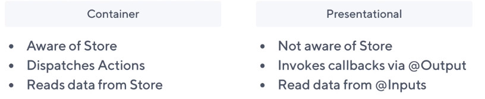
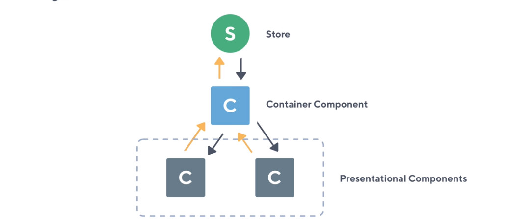
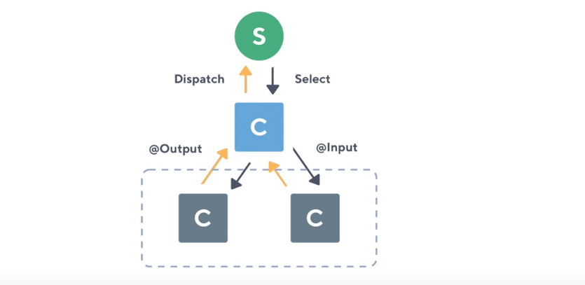
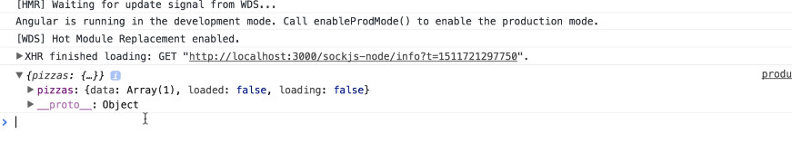
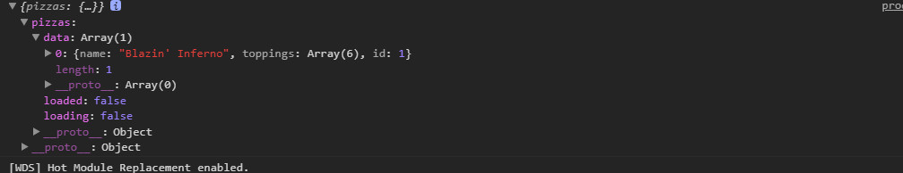

#  ngrx

## 术语

1. Creators : 类 ， 通过类我们可以去实例化（产生）一个对象；
2. factory: 函数，可以根据不同的参数，去生成各种不同的东西；
3. indexable Types https://www.typescriptlang.org/docs/handbook/interfaces.html#indexable-types

```ts
// topping.model.ts
export interface Topping {
  id?: number;
  name?: string;
  [key: string]: any;
}

```

4. register: always specific to module register. after a module registered in a root module or feature module, we can inject service in component of feature or root module ;

```ts
@NgModule({
  imports: [
    StoreModule.forFeature('products',reducers)
  ],
  providers: [],
  declarations: [],
  exports: [],
})
export class ProductsModule {}

```

## the course preknowledge

1. Feature Modules: https://angular.io/guide/feature-modules
2. Lazy Loading Feature Modules : https://angular.io/guide/feature-modules
3. angular && webpack : https://www.youtube.com/watch?v=qmIkoAnttlE

## Project Setup with Webpack  @ngrx/schematics

1. To use @ngrx/schematics as the default collection in your Angular CLI project, add it to your angular.json:

* ng set defaults.schematics.collection=@ngrx/schematics(angular 5) 
* ng config cli.defaultCollection @ngrx/schematics (angular 6)


## ngrx store overview (c 5)

1. change detection and the performance benefits that we get from using a single store or rather an observable approach to managing state in our applications . 

* a component doesn't really care where it gets data from . by default angular has a built in change detection strategy that it's tring to look in your component and it uses sometiong called a zone to be detect whether it needs to update or not  . now we can acturally use 'OnPush' changeDetectionStrategy to tell angular that our @inputs property will be 100% immutable . because of the patterns that we use with a single store we have our reducers which return pieces of new state . these new state are composed in an immutable way and we just simply use a selector to select a piece of state . So whenever that changes  we get it to our container components which then passed doen into stateless presentational component.

* So the beauty of using  the OnPush ChangeDetectionStrategy means that we're acturally comparing objects rather than checking properties and values(这就是使用 immutable 的好处，因为变化只是在自己原来的基础上产生的变化，具体可以看一下immutable) 

* So when we use our OnPush change detection strategy we're essentially telling angular to compare the references of objects rather than try work out what's changed with inside an object . No two objects are the same unless it's the same object , so essentially what will happen when we mutate(变化) some of our data and pass it back to the store , This  in effect will give us a brand new object 

* So angular can say does this object equal this object yes or no . if it's yes then clearly something hasn't changed and nothing will happen further down in that component . However if something has changed , those objects won't acturally equal each other there won't be of the same object identity , so this means angular can just essentially ignore all of the change detection and we can just use observables to push new changes down the component tree .

* We also get the route and feature module support , so we've got eagerly and we've got lazily loaded modules . Now in the application we're going to have a lazy loaded module and we'll use a for feature call on our storeModule which indicates to ngrx store what we have either an eagerly or a lazy loaded module now ngrx will support both of these out-of-the-box .

* we're going to take full advantage of using lazily loaded modules and ngrx behind the scenes when we load in an angular module will then bind itself to the parent store module which we can call the root module;

* a feature module delivers a cohesive set of functionality focused on a specific application need such as a user workflow, routing, or forms. 


## Reactive Component Architecture  (c 6)

1. reactive angular: what is reactive angular in the sense of a component architecture . There are couple of principles that we can use as a guideline when we come to building our angular component tree
* container component : which you see in our our project we have the containers fold and everything which we consider a presentational component just sits in a generic conponent folder 
* we are going to kind of explore some of the characteristics od the difference between the two so we can start to think how the store and the architecture of ngrx store and the effects all fit in to our container and presentational components 



2. The container component is aware of the store , the container component dispathes actions, the container compoennt also reads data from store . So the container is the communicator with our store in this case and we just simply render presentational components which are not aware ot the store. We don't inject the store ,and you can obviously if you like if you have a specific use case , then that is fine to inject the store , but ideally we should be thinking about containers and presentational components and whether something is aware id the store or not aware of store  .

3. The interesting thing between a presentational component is when we want to get something out of a component we then emit an output via angular's wvwnt emitter ,so that's how we get data out of a presentational component. Whereas(但是) if we look at the container we can see that we dispatch an action we still want to get data out of the component but it's now changed from perhaps injecting a service to ok the data is now leaving the component via an action . Now the presentational compoennt reads the data via @input and if we have look at the container it reads the data from the store and then we use something like the async pipe then pass it down as just pure data as an input to a presentational component.



* the orange arrows which represent an output and the gray arrows which represent an input, so we can see immediately at the top that our store is giving a container component an input of the data and it's up to us waht data we ask for from the store and this is where things like ngrx selectors come into play.

* I've added this separation block where we've got this dotted gray line around the presentational components(图中用灰色点画线 圈起来的区域块), So in this ponit I'm assumeing that any presentational component have zero knowledge that the store even exists(对store的存在 毫不知情). It's only given it's data via our container components . So we pass things down to presentational as an input and again we can then emit them as an output 



3. To get data into a container we use a select, to get data into a presentational component we use @input, to get data out of the presentational component we use an @output , to get data back to the store back to the reducer or effect we then use a store dispatch . Above is the data flow and how things communicate 

## Action constants and Creators (c 7)

1. The first thing that our application needs and what we're going to start with is this products component where we're going to dispatch an action saying that 'we want to lad the pizzas '. now when we acturally come to load the pizzas we're going to use ngrx/effects . however that is kind of down the line what we first want to do is kind of understand the building blocks of the store . We are going to populate it with some static data and then we are going to convert that to using an effect where we can communicate with the outside world and then bring that data back to our store. then pass the data into the container component  

```bash
+-- app
+-- products/
    +-- products.module.ts
    +-- container/
    +-- components/
    +-- models/
    +-- services/
    +-- store/
        +-- index.ts
        +-- actions/
            # where the action constants and our action creators are going to live 
            +-- pizzas.action.ts
        +-- reducers/
            +-- 
```

2. pizzas.action.ts

> When it comes to dealing with things like ngrx actions , it's a good ideal to think about the mental process(思维过程) as we go 

* first import the Action , create a class to implement the interface. when we see the typescript defination file , we have export interface action and it has a type property pf string. (其余的意思是，暴露的Action 接口只有一个 type 属性，而我们在实际应用的时候，需要增加许多额外的属性，此时我们的做法是 新增一个接口，用来实现与拓展Action)

```js 
export interface Action {
    type: string;
}
``` 

```js
import { Action } from '@ngrx/store';
import { Pizza } from '../src/products/models/pizza.model.ts';

// Let 's define some new constants , because we talked about namespacing . What I'm going todo is call this [Products], so this acts as a kind of namespace you don't have todo it , because in this example we're not acturally going to load pizzas anywhere else in our application, but it's a good practise to namespace these as per the feature modules(使用 feature module 的名字 作为 nameSpacing name ) 
// load pizzas

//-----------1. action constants
export const LOAD_PIZZAS = '[Products] Load Pizzas';
export const LOAD_PIZZAS_FAIL = '[Products] Load Pizzas Fail';
export const LOAD_PIZZAS_SUCCESS = '[Products] Load Pizzas Success';

// So we've defined the three things that can happed when we load the pizzas . First of all we want to dispatch an action called load the pizzas that's either going to fail or it's going to succeed . If it fails we can dispatch LOAD_PIZZAS_FAIL action ,when it's successful we can dispatch LOAD_PIZZAS_SUCCESS
// we're communicating here kind of via events and  these events describe the steps of what is happending in our application and we can then respond to them accordingly . So you may have guessed the next step is that we want to acturally define some action creators (creators 指的就是类，通过这些类 我们可以去实例或action) 

// The reason we imported Action interface is just to make sure for typescript purpose 

//-------2 action creators
export class LoadPizzas implements Action {
  readonly type = LOAD_PIZZAS;
}

export class LoadPizzasFail implements Action {
  readonly type = LOAD_PIZZAS_FAIL;
  // we can pass any message as a payload property back from the server if there is an error
  constructor ( public payload: any ) {
    
  }
}

export class LoadPizzasFail implements Action {
  readonly type = LOAD_PIZZAS_FAIL;
  // Instead of using a public payload of any , we are acturally going to get a pizza array . Now before we import the type we'll just jump acrooss the db.json which has all pizzas information inside . The db.json is a fake server that just uses pure JSON when we make a request to it , it's going to return the data (即我们要依据 服务器传回的数据形式，来去设计我们的modle, 即 pizza.model.ts)
  constructor ( public payload: Pizza[] ) {
    
  }
}

// In the end, what we now need to do is acturally export our  action types, these are simply used in our reducer , what we essentially need to do is export our own type called PizzasAction , we can then assign `action creators` to this
// ----------3 action types

export type PizzasAction = LoadPizzas | LoadPizzasFail | LoadPizzasSuccess;


```

## c 8 Creating our first Reducer

> we need have a reducer before any of actions can be responded to by our store 

```bash
+-- app
+-- products/
    +-- products.module.ts
    +-- container/
    +-- components/
    +-- models/
    +-- services/
    +-- store/
        +-- index.ts
        +-- actions/
            # where the action constants and our action creators are going to live 
            +-- pizzas.action.ts
        +-- reducers/
            +-- pizzas.reducer.ts
            +-- index.ts
        +-- index.ts
    +-- products.module.ts
```

1. pizzas.reducer.ts

```ts
import { Pizza } from './src/products/models/pizza.model.ts';

//--- 0. import action file
// we need import essentially all of our actions at once , we could do import load pizzas comma , load pizzas fail comma, what I like to do is use asterrisk that will import everything as what we can call that fromPizzas 
import * as fromPizzas from './src/products/store/actions/pizzas.acton';

// in ngrx we make massive(大量的) use of type checking , so let's go and make an interface , what we're going to call is the pizza state  , so this is defining a slice of state   that our reducer will manage   in our entire state tree 
//--- 1. state slice interface 
export interface PizzaState {
  data: Pizza[];
  loaded: boolean;
  loading: boolean;
}


// Inside this file we nedd a few things , we'll start off with our application initial state
//----2. initial state slice 
export const initialState: PizzaState = {
  data: [],
  loaded: false,
  loading: false
};

//---3. reducer function
export function reducer(
  state = initialState,
  action: fromPizzas.PizzasAction
):PizzaState {
  // 此处是一个易迷糊点 action是 fromPizzas.PizzasAction 即 `action creator` 的一个实例, 每个实例都有一个type 属性；而 type 属性又指向  `action constants` 
  switch(action.type) {
    // return a new representation of the state . We are going to return a brand new object , Now what we want to return is merging all of the initial state in , so our return statement is now conforming to what we've told it to in our reducer . 
    
    //-1- In fact when we dispatch an event called LOAD_PIZZAS , we're essentially telling the application that we are loading , in the initial state we've setted loadding false , so in this case we just want just say loading is true ;
    case fromPizzas.LOAD_PIZZAS: {
      return {
        ...state,
        loading: true
      }
    }

    //-2- In the LOAD_PIZZAS_SUCCESS case , we don't need to say that it loading ,so we're going to toggle that back to false . When the pizzas are loaded we want to acturally tell  our store that the state is now changed to load .  This allow us to contrl things like loading spinners , and when we come on to route guards we'll acturally be using this loaded preoperty to find out whether we loaded the pizzas , otherwise we're going to dispatch an action and make sure that those pizzas are loaded for us ;
    case fromPizzas.LOAD_PIZZAS_SUCCESS: {
      return {
        ...state,
        loading: false,
        loaded: true
      }
    }

    // in the LOAD_PIZZAS_FAIL situation , we're going to change loading property to false, and loaded property is also false , because on a fail we have definitely not loaded anything and this will eradicate(摧毁，连根拔起) any previous state 
    case from Pizzas.LOAD_PIZZAS_FAIL: {
      return {
        ...state,
        loading: false,
        loaded: false
      }
    }
  }

  return state;
}


```

2. store/reducers/index.ts

> The index.ts contains all of the reducers for the particular products feature module . Becasue we have a products module we're acturally going to export a new interface and we're gong to say this is the products state . 

```ts
import * as fromPizzas from './src/products/store/reducers/pizzas.reducer';

import { ActionReducerMap } from '@ngrx/store';
// we're acturally jumping up one level here , we're got a reducer that we've created, but we need to acturally make it part of the store .
//--1-- the module state which is a slice of entire state tree 
export interface ProductsState {
  //So at this point we're defining the structure of our state tree, so in our ProductsState we're going have a slice of State call pizzas. The actrual interface for this is going to correspond PizzaState which in pizzas.reducer.ts 
  pizzas: fromPizzas.PizzaState;
  // We've now composed a new interface that uses another interface further down our state tree (state tree 是分层的，首先是顶层的，state 其次是 feature module 的 ProductsState 底层是 PizzasState , 此处我们在构建中间层的时候利用了底层的PizzaState)
}

//--2-- Register our reducers ActionReducerMap
// On our reducers we know that slice of state is managed by a reucer function . The first of state is pizzas and consequently that is managed by the fromPizzas.reducer, so we're essentially taking our reducer function binding it to the pizzas . Now we can acturally type check this , so ngrx give us a small little utility which we can use so we can say import something called ActionReducerMap. The ActionReducerMap accept a generic type so what we can say is ProductsState . We're difinitely implementing the correct reducers based on the different levels of state .
// the reducers is essentially describing what these reducers look like and how they are composed 

export const reducers: ActionReducerMap<ProductsState> = {
  pizzas: formPizzas.reducer,
}

```
3. store/index.ts 
> 生成这个文件的原因见下

```ts
// to pass up what we just crated , so we are inside our reducers folder we have a index.ts(reducers/index.ts) , we can essentially access the reducers: ActionReducerMap

// we need to do this because this is boilerplate with setting up our store piece-by-piece(一个接一个,一片一片的)
export * from './src/products/store/reducers'

// 目的是 pass the reducers up one directore so er can access it in products.module.ts 

```

4. products.module.ts

```ts

//import the StoreModules, because our products module has no idea that ngrx store exists at this point or that we want to start creating our own data structures
// It's up to us at this point to go and register this module  
import { StoreModule } from '@ngrx/store';

// 
import { reducers } from './src/products/store';

//----
@NgModule({
  import: [
    //-----
    // forFeature allows us to essentially lazy load everything to do with our store and it will bind itself to the root store object , so we"ve just got one object and when we lazy load a module , such as the ProductsModule itself which is completely lazy loaded.
    // Once we use the foFeature this will essentially attach itself to our root store (app.module.ts---  StoreModule.forRoot({}, { metaReducers }),)
    // When our products module loads ，we then bind StoreModule.forFeature() to that root object . So that's what is happending that's the idea behind it .
    // The forFeature method accepts an argument , we need to say that it's going to the 'products' and we can then pass an empty object as the second argument . The empty object is acturally going to be our reducers so inside the /products/store/ folder waht we need to do again is acturally export evertthing inside of here. That is why we created this products/store/index.ts 暴露整个sore 的所有东西；
    
    // our reducers are now registered with our feature store module 
    StoreModule.forFeature('products', reducers)
  ]
})
export class ProductsModule {}

```

## c 9 Store Selectors

1. register our storeModule and use Store in the component 

```ts
// in pizzas.reducer.ts
export const initialState: PizzaState = {
  data: [],
  loaded: false,
  loading: false
};
```

Now what we acturally want to do is somehow display one particular property(data) which will be our array of pizzas  in the actural angular application , so the way we do this is through something  called a selector .
 
Now before we get started what we're going to do is acturally populate this initial state with some values . we're going to jump into the db.json and we're going to take any pizza you can just select any one that you want . Now we can copy that whole object , now waht we're going to do is just paste it for now inside of the data property. So we're providing some initial stae to our pizzas so we're going to end up with one pizza . once we've finalized creating a selector which allows us to select this particular slice of state.

```ts
// in pizzas.reducer.ts
export const initialState: PizzaState = {
  
  loaded: false,
  loading: false
};
```


What we acturally want to do before any of that is set up our container conponent to accept the store.   

```ts
// products/containers/products/products.component.ts

//--1 import store
import { Store } from '@ngrx/store';
//--2 import Observable type checking
import { Observable } from 'rxjs/Observable';
//--3 import anything from store
import * as fromStore from './src/products/store';

// products/containers/products.component.ts
export class ProductsComponent implements OnInit {
  pizzas: Pizza[];

  //--4-inject store-- What we acturally want tosso is allow us to pass the ProductsState, so we can acturally type check this inside of a component 
  // 依赖注入 Store : inside the constructor we can say private store is going to be of type Store which accept a generic type as well( because store is an observable of state and an observer of actions, so the same as Observable we should specify a generic type) .
  // we can specify fromStore.ProductsState, that mean we can access that ProductsState. So this is type checking that anything that we access inside of here alongside of our ProductsState . 
  //That means that we can only select things from the store that correspond or exist in the ProductsState 
  constructor(privite store: Store<fromStore.ProductsState>) {}

  // how we can obtain properties from our store ? we can use the store.select() method 
  ngOnInit() {
    // we can pass in either a string or or we can pass in a function , if we pass in a function , it will return us a lice of state . 
    // For this I'm going to do is just say select me the 'products'. now we're doing this because we have a slice of state 
    // what we need do is essentially create a selector with the top=level property of 'products', so that we could jump a level down into our data structure to be able to access defferent properties  (select 中所传递的 'product' 实际上是 selector的一个 property ) ('products' 实际上是和 /products.module.ts 中的  StoreModule.forFeature('products',reducers) 这条代码相对应的)
    this.store.select<any>('products').subscribe(
      state => {
        console.log(state);
      }
    )
  }
}
```
********** 打印结果



```ts
// store/index.ts
export interface ProductsState {
  pizzas: fromPizzas.PizzaState,
}

export const reducers: ActionReducerMap<ProductsState> = {
  pizzas: fromPizzas.reducer,
}

// we just created a pizza reducers and we call that the pizzas . The pizza reducer then manages a small selection of state which have the data , the loaded, the loading property ;
// the store.select() method give us the state for the particular module which in our case is the products module and when we registered our store we said StoreModule.forFeature('products',reducers)

// we passed in that string which says products , so that's why we've asked in the select method for a property called 'products'
```

2. selector 



* how do we get the data property of state in to component For the above we need something called selector. 
* selector is essentially a function where we can compose different levels of state and we can return a new piece of State
* Let's create our first selector which will allow us to render the 'data' in to our angular application.

```ts
// products/store/reducers/pizzas.reducer.ts

// what we can do is to export a function which allows ngrx is essentially access PizzaState property without us needing to repeat ourselves over and over again .
// so selecttor is somthing you use to compose state state and then we actually use the selector alongside store.select() in our components 
export interface PizzaState {
  data: Pizza[];
  loaded: boolean;
  loading: boolean;
}

// function which accept state that type of PizzaState  , so this is the piece of state that were given to us and it's going to be of type PizzaState
export const getPizzasLoading = (state: PizzaState) => state.loading;
export const getPizzasLoaded = (state: PizzaState) => state.loaded;
export const getPizzasLoading = (state: PizzaState) => state.data;
// these are small functions that get passed the small level of the pizza state and at that point in time we are down in our data structure . So this is a goog practice, put these undernearth your reducers.
// Now we can compose things one level up and acturally pass this into what we call a create selector function (in reducers/index.ts)

```

* to create the base level of our state object .

```ts
// reducers/index.ts

import { createFeatureSelector, createSelector } from '@ngrx/store';

// this is going to be a constant which holds a selector for our entire lazy loaded module . Now to create a selector waht we need to do is to import createFeatureSelector method , and pass in a string called 'products';
// where this 'products' come frome? this was acturally when we register our module StoreModule.forFeature('products',reducers) . this particular feature starts with an object property called products ,so anything in this feature module is relied on a property called 'products '

// so below code is creating a base reference to that 'products property' on our state . Because we have typescript here  what we can actually do is pass in the ProductState as the generic type ;

export const getProductsState = createFeatureSelector<ProductState>('products');

// To get this working in our component we acturally need another selector to essentially compose our product state , so we take the top level products and we'll 

// pizzas state
// to export another const , what this is going to do is return us the products.pizzas . So we're going from from the top and  down from products , then we're selecting that pizzas piece of State. Now we can do this by using the createSeletor, instead of the createFeatureSelector
// to import the createSelector function , then we can pass in other selectors or we can pass in the functions we just created in products/store/reducers/pizzas.reducer.ts , which then we can pass to a component to select that slice of data all the way down the state tree 

```


