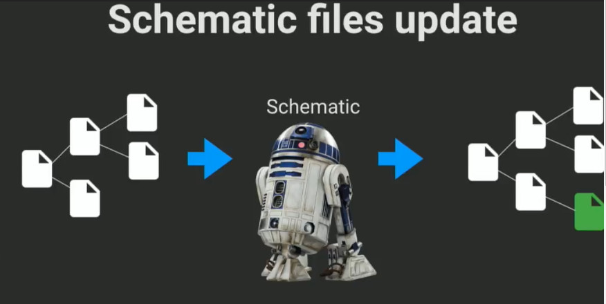
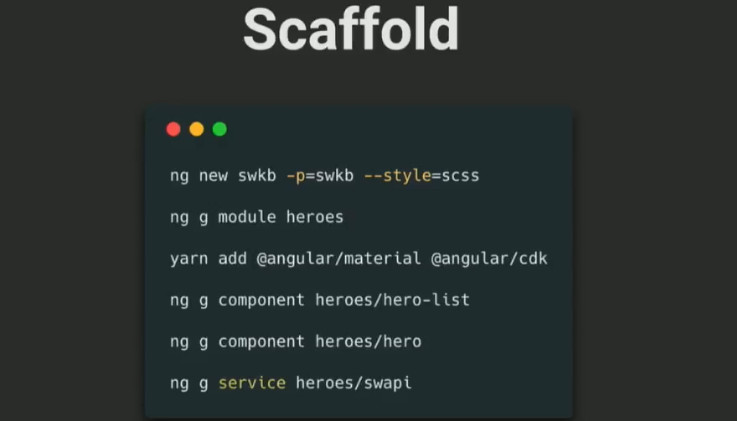
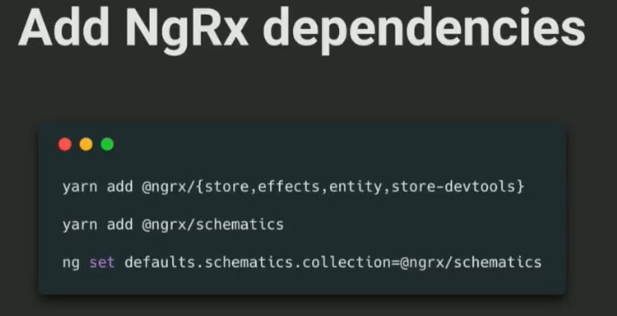
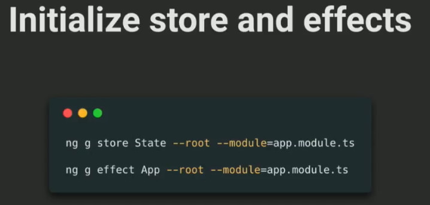
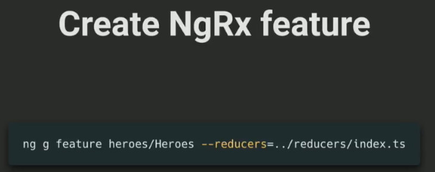
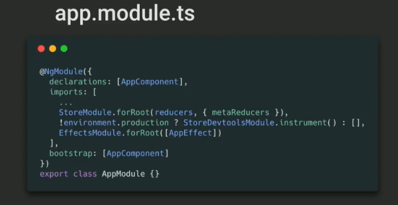
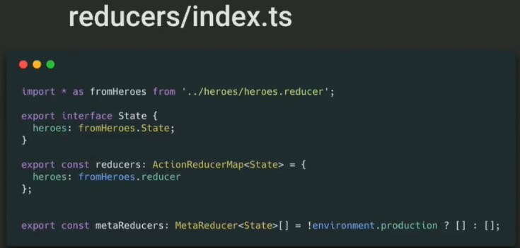
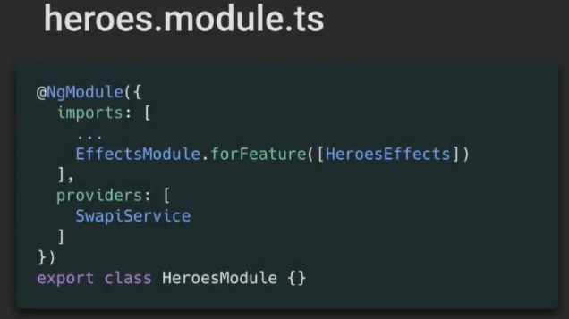

# NgRx Schematics

> https://www.youtube.com/watch?v=q3UcqG72Zl4

Before you can play a concert and entertaining you should do boring setup, and programming we do the dame thing . We setup our build system our boilerplate code and so on . What schematic are the tool that will help you to reduce boilerplate code and have more time to implement you own business project. 

Always we shoud write action reducers containers .. once and once again and again, that is boring. One way to solve above problem is to create some 'abstraction layer' on top of your ngrx tools 

angular team provides us with the tools angular-cli , we can create the whole application with it and all pieces like component , pipes, services . How this stuff was extracted from angular-cli into a separate project called schematics

```bash
npm i -g @angular-devkit/schematics-cli
```

what actually schematics do ? Let's think about files tree . Files tree like a state , and we passing it to schematic which in this case some kind of reducer . You pass in your files and schematic return you new state --- updated files or remove files or something else  

 

ngrx team provides us a tool @ngrx/schematics that allow us to create your action | container | effect | reducer | store | feature 

How we can Scaffold our application ? Of course I going to use angular-cli



-p --prefix default value:app. The prefix to use for all component selectors.







feature is just as for three schematics action , reducer and effect . so you just run one schematic and it set up whole stuff for you . We specified that we're going to use our feature reducer inside a whole root reducer providing the path to this reducer 



At this point we have a root module set up our store with our reducer and metaReducer, we got StoreDevTools, and at the end we got effects set up. 



If we look in our reducer we will see schematic  import our feature reducer inside root reducer , implements the interface for our State and has reducers map for us 

 

> 上述的东西 @ngrx/schematics 没有帮我们做，我们需要自己去修改

Then inside this feature model called heroes , we have effects module setup for this particular feature module 

========================

```js
// heroes.actions.ts
import { Action } from '@ngrx/store';

export enum HeroesActionTypes {
  HeroesAction = '[Heroes] Action'
}

export class Heroes implements Action {
  readonly type = HeroesActionTypes.HeroesAction;
}

export type HeroesActions = Heroes;

```

what we got in heroes.actions.ts file ? In general really nothing we got dummy(假的) action type which HeroesActions , but face data we need three more kind of actions , fetch that will trigger our fetching process . Fectch success go back to map our data to  store and fetch error action if something going wrong . So how we can make it better ? how we can use schematics for that ? -- 'we can extend ngrx to build our own template for fetch actions '

> Fetch 提供了对 Request 和 Response （以及其他与网络请求有关的）对象的通用定义。发送请求或者获取资源，需要使用 GlobalFetch.fetch 方法。 我们请求 reducer 就像 就像请求后台输入地址一样去 fetch action.


we can extend ngrx schematics to build our own template for fetch actions , sp to set up schematics we should use schematics this is some kind of circle of dependency like robots making robots . 

```bash
npm install -g @angular-devkit/schematics-cli

schematics schematic --name=fetch-actions

cd fetch-actions

yarn | npm install 

yarn add @ngrx/schematics | npm install -s @ngrx/schematics@5.2.0

```

To create custom schematic first of all , we are going tp set up a schematic cli globally , and schematic provide us with handy command called schematics, then we're going to specify templates for our new schematic that called schematic , then we pass in our schematics collection name , in our case it will be fetch-actions, then we're going to move to our newly created folder set up all dependencies via npm, then we're adding ngrx/schematics as dependency because we're going to use their code base and just provide our own template for a schematic 

What is the structure of every schematic ?

```json
{
  "$schema": "./node_modules/@angular-devkit/schematics/collection-schema.json",
  "schematics": {
    "fetch-actions": {
      "aliases": [ "fa" ],
      "description": "Generates ngrx fetch actions",
      "factory": "./fetch-actions",
      "schema": "./node_modules/@ngrx/schematics/src/action/schema.json"
    }
  }
}

// factory file that grabs all arguments from Cli , parsing them , transforming and passing to our templates

// schema stands for specify all types of our arguments, what arguments are required , description for each argument such kind of documentation

```

The main file for each collection is called collection.json file


