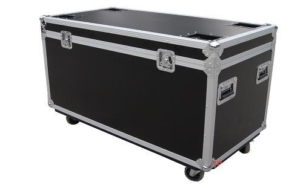

# 关于数据展示屏幕的方案选型

> 尺寸来源于厂商资料，根据厂商不同，可能会稍微有点区别，但是差距可以忽略不计

> 示例图片来源于互联网 仅供参考

## 屏幕尺寸

1. 3X3 55寸 (大恒能源)
* 单块尺寸：1213.5 X 684.3 mm
* 整体尺寸： 3647.5 X 2059.9 mm （按缝隙3.5mm计算的理论值）

2. 4X4 46寸 (阳光电源)
* 单块尺寸：1021.98 X 576.57 mm 
* 整体尺寸：4098.42 X 2316.78 mm （按缝隙3.5mm计算的理论值）

## 屏幕缝隙

1. 5mm 

2. 3.5mm（建议使用，大恒展会凭借屏使用规格）

3. 1.8mm

## 面板品牌

> 框架与内电路板均是国产

1. samsung（建议使用）

* 展会拼接屏基本都是三星面板 

2. lg

## 支架类型

1. 壁挂式

* 一经安装无法移动，或者再次安装无法保证安装精度

2. 落地支架式（建议使用）

* 可移动

## 包装类型

1. 普通包装

2. 航空包装箱（建议使用）
* 1装4块46寸屏
* 1装3块55寸屏

## 分辨率

1. 1080p 
2. 720p
